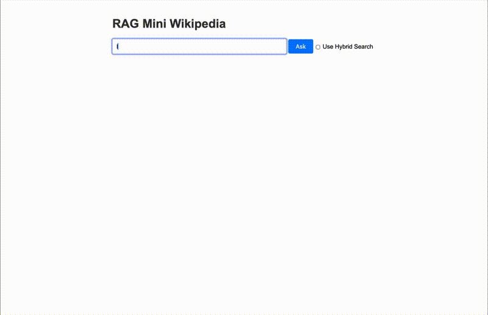

# Mini-Wikipedia RAG Project

A retrieval-augmented generation (RAG) system built over the [rag-mini-wikipedia](https://huggingface.co/datasets/rag-datasets/rag-mini-wikipedia) dataset from HuggingFace (3,200 passages, 918 Q&A pairs). Core components are **self-implemented from scratch** to demonstrate deep understanding of RAG internals.


## Demo


## Architecture

```
Query → Embed (OpenAI) → FAISS Vector Search → Cross-Encoder Rerank → Prompt Builder → LLM → Answer
                              ↑ (optional)
                          BM25 + RRF Fusion
```

## What's Self-Implemented

| Component | Description |
|:----------|:------------|
| **Recursive Text Chunking** | Configurable separators (`\n\n` → `\n` → `. ` → ` ` → `""`), chunk overlap, recursive re-splitting |
| **FAISS Retrieval** | Direct index manipulation — embed query, search, map back to documents |
| **Cross-Encoder Reranking** | Over-retrieve k=10 with bi-encoder, rerank with `ms-marco-MiniLM-L-6-v2`, keep top 3 |
| **BM25** | TF-IDF scoring with IDF weighting and document length normalization |
| **Hybrid Search (RRF)** | Reciprocal Rank Fusion combining vector + BM25 scores |
| **Evaluation Framework** | Recall@3, MRR, Token F1, LLM-as-Judge across 918 questions |

**Using LangChain for:** embedding wrapper (`OpenAIEmbeddings`), LLM wrapper (`ChatOpenAI`), FAISS docstore integration.

## Results (918 Questions)

| Metric | Vector Only | Hybrid (BM25 + Vector) |
|:-------|:-----:|:-----:|
| Recall@3 | **93.36%** | 88.02% |
| MRR | **0.9054** | 0.8571 |
| LLM-as-Judge Accuracy | **83.12%** | 80.50% |
| Avg Latency | 1.65s | 1.64s |

Pure vector search outperforms hybrid on this dataset — the passages are well-formed natural language where semantic embeddings excel. See the notebook for full analysis.

## Setup

### Prerequisites

- Python 3.10+
- OpenAI API key

### Installation

```bash
pip install -r requirements.txt
```

### Run

```bash
# Create .env file with your API key
echo "OPENAI_API_KEY=your-key-here" > .env

# Run the web app
python -m uvicorn app:app --reload

# Or run the notebook for experimentation
jupyter notebook mini-wikipedia.ipynb
```

## Tech Stack

- **Embeddings:** OpenAI `text-embedding-3-large` (3,072 dims)
- **LLM:** OpenAI `gpt-5.2`
- **Vector Store:** FAISS `IndexFlatL2`
- **Reranker:** `cross-encoder/ms-marco-MiniLM-L-6-v2`
- **Dataset:** HuggingFace `rag-datasets/rag-mini-wikipedia`
